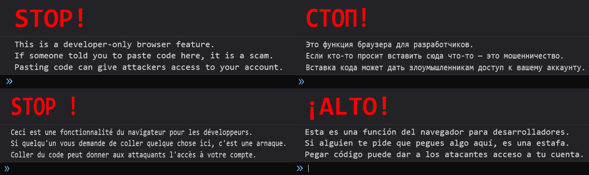

# console-self-xss-warning

Show a self-XSS warning in the browser console to protect users from social
engineering.



### Features

- Runs only in the browser and is safe for SSR.
- Default language is auto-detected via `navigator.language` with `en` fallback.
- Language tags use [BCP 47](https://developer.mozilla.org/en-US/docs/Glossary/BCP_47_language_tag) with normalization and primary subtag fallback (e.g. `en-US` -> `en`).
- Built-in translations for 40+ languages.
- `\\n` in translations is converted to a real line break in console output.
- No external dependencies.

## Install

```
npm install console-self-xss-warning
```

## Quick start

```ts
import { showConsoleWarning } from "console-self-xss-warning";

showConsoleWarning();
```

## Framework examples

Full examples for popular frameworks and Vanilla JS are in [`examples/`](https://github.com/hksm-app/console-self-xss-warning/tree/main/examples).

- Vanilla JS: [`examples/vanilla/README.md`](https://github.com/hksm-app/console-self-xss-warning/tree/main/examples/vanilla/README.md)
- React: [`examples/react/README.md`](https://github.com/hksm-app/console-self-xss-warning/tree/main/examples/react/README.md)
- Next.js: [`examples/nextjs/README.md`](https://github.com/hksm-app/console-self-xss-warning/tree/main/examples/nextjs/README.md)
- Vue: [`examples/vue/README.md`](https://github.com/hksm-app/console-self-xss-warning/tree/main/examples/vue/README.md)
- Nuxt: [`examples/nuxt/README.md`](https://github.com/hksm-app/console-self-xss-warning/tree/main/examples/nuxt/README.md)
- Svelte/SvelteKit: [`examples/svetle/README.md`](https://github.com/hksm-app/console-self-xss-warning/tree/main/examples/svetle/README.md)
- Vite: [`examples/vite/README.md`](https://github.com/hksm-app/console-self-xss-warning/tree/main/examples/vite/README.md)
- Angular: [`examples/angular/README.md`](https://github.com/hksm-app/console-self-xss-warning/tree/main/examples/angular/README.md)
- Astro: [`examples/astro/README.md`](https://github.com/hksm-app/console-self-xss-warning/tree/main/examples/astro/README.md)
- Remix: [`examples/remix/README.md`](https://github.com/hksm-app/console-self-xss-warning/tree/main/examples/remix/README.md)
- Gatsby: [`examples/gatsby/README.md`](https://github.com/hksm-app/console-self-xss-warning/tree/main/examples/gatsby/README.md)
- Solid: [`examples/solid/README.md`](https://github.com/hksm-app/console-self-xss-warning/tree/main/examples/solid/README.md)
- Qwik: [`examples/qwik/README.md`](https://github.com/hksm-app/console-self-xss-warning/tree/main/examples/qwik/README.md)

## Configuration

| parameter | default | required | description |
| --- | --- | --- | --- |
| `translations` | built-in translations | no | override texts and styles per language |
| `forceLang` | auto-detect (`navigator.language`) | no | force a specific language |
| `once` | `true` | no | show only once per page load |
| `productionOnly` | `false` | no | show only in production mode |
| `clearConsole` | `false` | no | clear the console before logging |
| `productionOnlyEnvKey` | default key list | no | read `productionOnly` from an env variable |
| `config` | default warning config | no | override styles and behavior defaults |

### Language tags (BCP 47)

Language keys and `forceLang` accept [BCP 47 language tags](https://developer.mozilla.org/en-US/docs/Glossary/BCP_47_language_tag) (e.g. `en`, `en-US`, `pt-BR`).
Tags are normalized to lowercase with `-`, and if a region-specific tag is not
found the primary subtag is used as a fallback (e.g. `en-US` -> `en`).

### Common options

```ts
showConsoleWarning({
  once: true,            // show only once per page load
  clearConsole: false,   // optionally clear console before warning
  productionOnly: false  // gate by production environment
});
```

### Custom translation

```ts
showConsoleWarning({
  translations: {
    en: {
      title: "STOP!",
      message:
        "This is for developers only.\nIf someone asks you to paste code here, it is a scam.",
      titleStyle: "color:#d00;font-size:52px;font-weight:900;",
      messageStyle: "font-size:16px;"
    }
  }
});
```

### Full custom JSON

```ts
const translations = {
  en: {
    title: "STOP!",
    message: "Private area.\nDo not paste anything here."
  },
  fr: {
    title: "STOP !",
    message: "Zone privée.\nNe collez rien ici."
  }
};

showConsoleWarning({
  translations,
  forceLang: "en",
  clearConsole: true
});
```

### Config overrides

| key | default | description |
| --- | --- | --- |
| `defaultTitleStyle` | `color:red;font-size:48px;font-weight:bold;` | default title style |
| `defaultMessageStyle` | `font-size:16px;` | default message style |
| `defaultSpamIntervalMs` | `2000` | repeat interval for the warning in ms |
| `devtoolsSizeThresholdPx` | `160` | threshold used to detect open devtools |


## Environment config for productionOnly

If you want `productionOnly` to be driven by an environment variable, pass
your own key name using `productionOnlyEnvKey`.

```ts
showConsoleWarning({
  productionOnlyEnvKey: "MY_APP_CONSOLE_WARNING_PROD_ONLY"
});
```

You can also pass multiple keys (first match wins):

```ts
showConsoleWarning({
  productionOnlyEnvKey: ["MY_KEY_1", "MY_KEY_2"]
});
```

Boolean values accepted: `1/0`, `true/false`, `yes/no`, `on/off`

Default keys (if you do not pass anything):

- `CONSOLE_SELF_XSS_WARNING_PRODUCTION_ONLY`
- `VITE_CONSOLE_SELF_XSS_WARNING_PRODUCTION_ONLY`
- `NEXT_PUBLIC_CONSOLE_SELF_XSS_WARNING_PRODUCTION_ONLY`

## API

```ts
type Options = {
  translations?: {
    [lang: string]: {
      title: string
      message: string
      titleStyle?: string
      messageStyle?: string
    }
  }
  forceLang?: string
  once?: boolean
  productionOnly?: boolean
  clearConsole?: boolean
  productionOnlyEnvKey?: string | string[]
  config?: {
    defaultTitleStyle?: string
    defaultMessageStyle?: string
    defaultSpamIntervalMs?: number
    devtoolsSizeThresholdPx?: number
  }
}

showConsoleWarning(options?)
```
